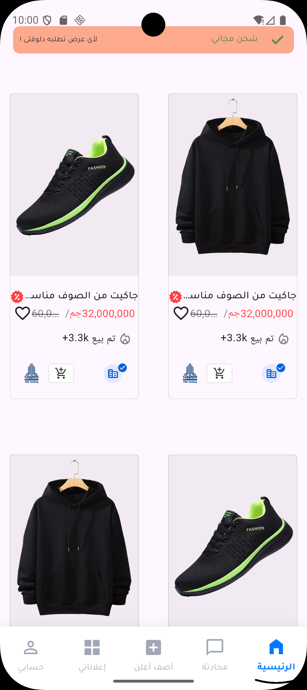
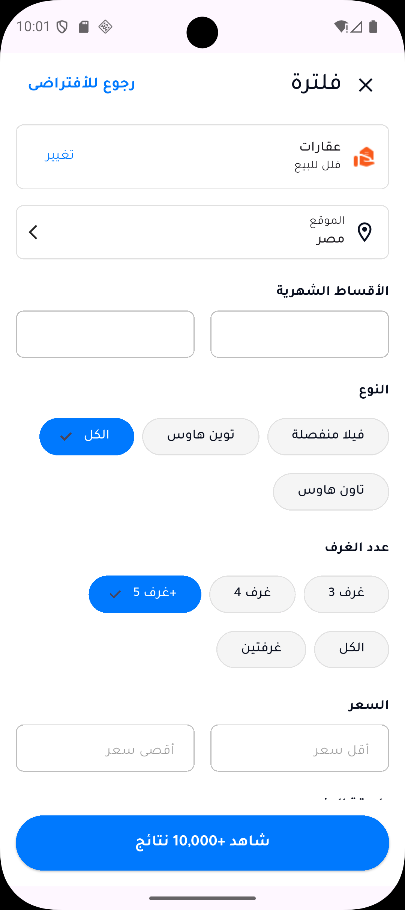
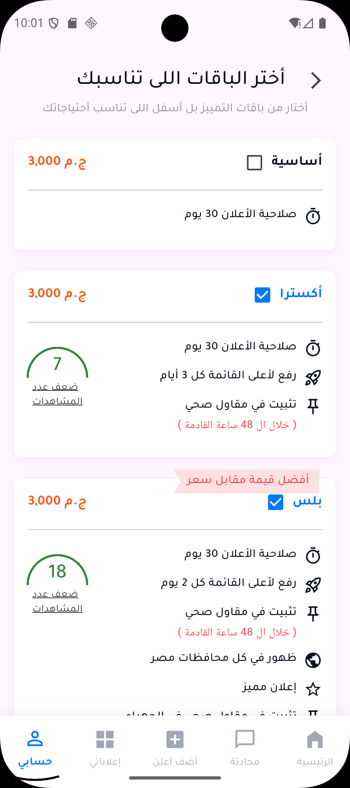
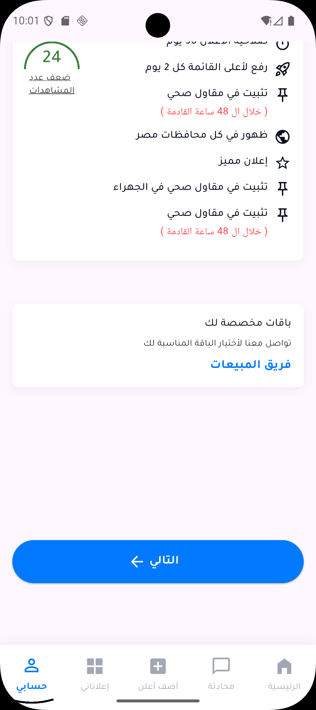
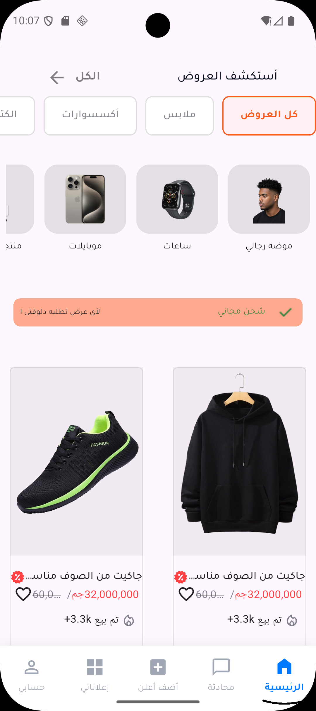
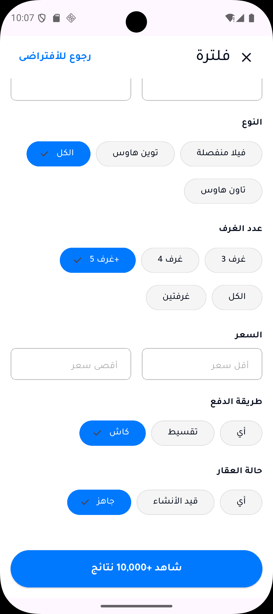

<div align="center">

# 🎯 Otex - Offers Explorer

### Premium Flutter Application for Product Discovery & Advertisement Management

[](https://flutter.dev/)
[](https://dart.dev/)
[](https://bloclibrary.dev/)
[](LICENSE)

**A production-ready, feature-rich mobile application showcasing modern Flutter development practices**

[Features](#-key-features) • [Architecture](#-architecture--design-patterns) • [Screenshots](#-screenshots) • [Installation](#-installation) • [Contact](#-contact)

</div>

---

## 📱 Overview

**Otex** is a sophisticated Flutter application that demonstrates enterprise-level mobile development with a focus on scalability, maintainability, and exceptional user experience. This project showcases advanced implementation of state management, responsive design, and clean architecture principles.

The application provides users with a seamless platform to explore product offers, manage advertisement campaigns through tiered subscription plans, and apply advanced filtering to personalize their browsing experience.

---

## ✨ Key Features

### 🏪 **Dynamic Offers Discovery**
- **Grid-based Product Display**: Optimized layout showcasing products with high-quality images and essential details
- **Horizontal Category Navigation**: Smooth scrolling categories with active state indication
- **Real-time Updates**: Dynamic content loading with efficient state management
- **Intuitive UI/UX**: Clean, modern interface focused on user engagement

### 📢 **Tiered Advertisement System**
Four premium subscription tiers designed for different business needs:

| Plan | Features | Target Users |
|------|----------|--------------|
| **Basic** | Essential listing features | New businesses |
| **Extra** | Enhanced visibility + priority support | Growing businesses |
| **Plus** | Advanced analytics + featured placement | Established businesses |
| **Super** | Full premium features + dedicated support | Enterprise clients |

### 🔍 **Advanced Filtering Engine**
- **Multi-parameter Search**: Location, price range, category, and custom attributes
- **Persistent Filter State**: Filters maintained across app sessions
- **Real-time Results**: Instant feedback as filters are applied
- **Smart Suggestions**: Context-aware filter recommendations

### 🎨 **Responsive Design System**
- **Adaptive Layouts**: Seamless experience across all screen sizes
- **Percentage-based Dimensions**: Intelligent scaling using viewport calculations
- **Custom Theming**: Consistent design language throughout the application
- **Smooth Animations**: Polished transitions and micro-interactions

### 🧭 **Professional Navigation System**
- **Custom Bottom Navigation**: Unique design with animated active indicator
- **Route-based Architecture**: Clean, declarative navigation using GoRouter
- **Deep Linking Support**: Direct navigation to specific app sections
- **Navigation State Persistence**: Maintains user context across sessions

---

## 🏗️ Architecture & Design Patterns

### **Clean Architecture Implementation**

```
┌─────────────────────────────────────────────────────────┐
│                    Presentation Layer                    │
│  (Views, Widgets, State Management - BLoC/Cubit)       │
└────────────────────┬────────────────────────────────────┘
                     │
┌────────────────────▼────────────────────────────────────┐
│                     Domain Layer                         │
│         (Business Logic, Use Cases, Entities)           │
└────────────────────┬────────────────────────────────────┘
                     │
┌────────────────────▼────────────────────────────────────┐
│                      Data Layer                          │
│    (Repositories, Data Sources, Local Database)         │
└─────────────────────────────────────────────────────────┘
```

### **State Management Strategy**
- **BLoC Pattern**: Separation of business logic from UI components
- **Cubit Implementation**: Simplified state management for straightforward scenarios
- **Stream-based Architecture**: Reactive programming for real-time updates
- **Single Source of Truth**: Predictable state flow throughout the application

### **Project Structure**

```
lib/
├── 📦 core/
│   ├── app_colors.dart              # Centralized color palette
│   ├── assets_images.dart           # Asset path constants
│   ├── text_styles.dart             # Typography system
│   ├── dimensions/
│   │   └── app_dimensions.dart      # Responsive dimension utilities
│   └── routing/
│       ├── app_router.dart          # Route configuration
│       └── routes_names.dart        # Route name constants
│
├── 🎯 features/
│   ├── offers/                      # Offers discovery feature
│   │   ├── data/
│   │   │   ├── models/
│   │   │   └── repositories/
│   │   ├── domain/
│   │   │   ├── entities/
│   │   │   └── use_cases/
│   │   └── presentation/
│   │       ├── view/
│   │       ├── widgets/
│   │       └── cubit/
│   │
│   ├── plans/                       # Advertisement plans feature
│   │   ├── data/
│   │   ├── domain/
│   │   └── presentation/
│   │
│   └── filtering/                   # Advanced filtering feature
│       ├── data/
│       ├── domain/
│       └── presentation/
│
├── 🧠 logic/
│   └── category_cubit.dart          # Global category state
│
├── 🎨 presentation/
│   ├── cubit/
│   │   └── bottom_nav_cubit.dart    # Navigation state management
│   └── widgets/
│       └── custom_bottom_nav_bar.dart
│
└── 🚀 main.dart                     # Application entry point
```

---

## 🛠️ Technology Stack

### **Core Technologies**

| Technology | Version | Purpose |
|------------|---------|---------|
| [Flutter](https://flutter.dev/) | 3.x | Cross-platform UI framework |
| [Dart](https://dart.dev/) | 3.x | Programming language |
| [flutter_bloc](https://pub.dev/packages/flutter_bloc) | Latest | State management solution |
| [go_router](https://pub.dev/packages/go_router) | Latest | Declarative routing |
| [flutter_svg](https://pub.dev/packages/flutter_svg) | Latest | SVG rendering |
| [sqflite](https://pub.dev/packages/sqflite) | Latest | Local database persistence |

### **Development Principles**
- ✅ **Clean Code**: Self-documenting, readable, and maintainable
- ✅ **SOLID Principles**: Robust object-oriented design
- ✅ **DRY (Don't Repeat Yourself)**: Reusable components and utilities
- ✅ **Separation of Concerns**: Clear boundaries between layers
- ✅ **Responsive Design**: Mobile-first approach with adaptive layouts

---

## 📸 Screenshots

<div align="center">

### Home Screen - Offers Discovery


*Dynamic grid layout with horizontal category navigation*

---

### Advertisement Plans Selection


*Four-tier subscription system with detailed feature comparison*

---

### Plan Details & Features


*Comprehensive breakdown of plan benefits and pricing*

---

### Advanced Filtering Interface


*Multi-parameter search with intuitive controls*

---

### User Profile & Settings


*Clean, organized user management interface*

---

### Additional Features


*Extended functionality and user engagement features*

</div>

---

## 🚀 Installation

### Prerequisites

- Flutter SDK 3.x or higher
- Dart SDK 3.x or higher
- Android Studio / VS Code with Flutter extensions
- iOS development: Xcode (macOS only)

### Setup Instructions

1. **Clone the repository**
   ```bash
   git clone https://github.com/yourusername/otex-flutter.git
   cd otex-flutter
   ```

2. **Install dependencies**
   ```bash
   flutter pub get
   ```

3. **Run code generation (if applicable)**
   ```bash
   flutter pub run build_runner build --delete-conflicting-outputs
   ```

4. **Run the application**
   ```bash
   flutter run
   ```

### Build for Production

**Android:**
```bash
flutter build apk --release
# or
flutter build appbundle --release
```

**iOS:**
```bash
flutter build ios --release
```

---

## 🎯 Code Quality & Best Practices

### **What Makes This Project Stand Out**

✨ **Enterprise-Grade Architecture**
- Feature-based modular structure for scalability
- Clear separation between presentation, domain, and data layers
- Easily testable components with dependency injection

🎨 **Professional UI/UX**
- Consistent design system with reusable components
- Smooth animations and micro-interactions
- Accessibility considerations built-in

🔒 **Performance Optimized**
- Efficient state management preventing unnecessary rebuilds
- Image caching and lazy loading strategies
- Optimized list rendering for large datasets

📱 **Production Ready**
- Error handling and edge case management
- Comprehensive null safety implementation
- Local data persistence for offline functionality

---

## 🧪 Testing

```bash
# Run all tests
flutter test

# Run tests with coverage
flutter test --coverage

# View coverage report
genhtml coverage/lcov.info -o coverage/html
open coverage/html/index.html
```

---

## 📚 Learning Resources

This project demonstrates implementations of:
- [Flutter BLoC Pattern](https://bloclibrary.dev/)
- [GoRouter for Navigation](https://pub.dev/packages/go_router)
- [Responsive Design in Flutter](https://docs.flutter.dev/ui/layout/responsive/adaptive-responsive)
- [Clean Architecture Principles](https://blog.cleancoder.com/uncle-bob/2012/08/13/the-clean-architecture.html)

---

## 🤝 Contributing

Contributions, issues, and feature requests are welcome! Feel free to check the [issues page](../../issues).

---

## 👨‍💻 About the Developer

**Ahmed Abdelkrim**
*Flutter Developer*

Passionate about creating beautiful, performant mobile applications with clean architecture and exceptional user experiences.

### 📫 Get in Touch

[](mailto:ahmedabdelkrim125@gmail.com)
[](https://www.linkedin.com/in/ahmed-abdelkrim166)
[](https://www.facebook.com/ahmed85814A)

---

## 📄 License

This project is licensed under the MIT License - see the [LICENSE](LICENSE) file for details.

---

## 🙏 Acknowledgments

- Flutter team for the amazing framework
- The open-source community for excellent packages and resources
- All contributors who help improve this project

---

<div align="center">

### ⭐ If you find this project helpful, please consider giving it a star!

**Built with ❤️ using Flutter**

</div>
